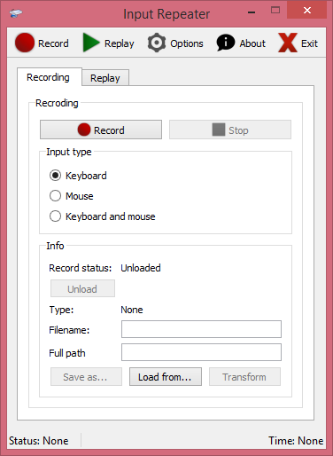

# InputRepeater
InputRepeater is a windows program letting you record and replay input from mouse and keyboard. It can automate certain activities like grinding in games, autoclicking, doing repeatable actions etc.

## Features
- recording mouse input, keyboard input or both
- replaying input with options of changing speed and looping
- saving records to hard drive
- transforming record
- program configuration (user notification, tray icon, etc.)

## Releases
//todo

## About Project
Solution was created with Visual Studio 2017 with Qt 5.9. Qt ".pro" and ".pri" files were automatically generated by Visual Studio Qt add-on.  Recording and replaying input is done by "InputUtilities.dll".

### Building
This project uses open source QHotkey library.
C++17 is required to build this project.
